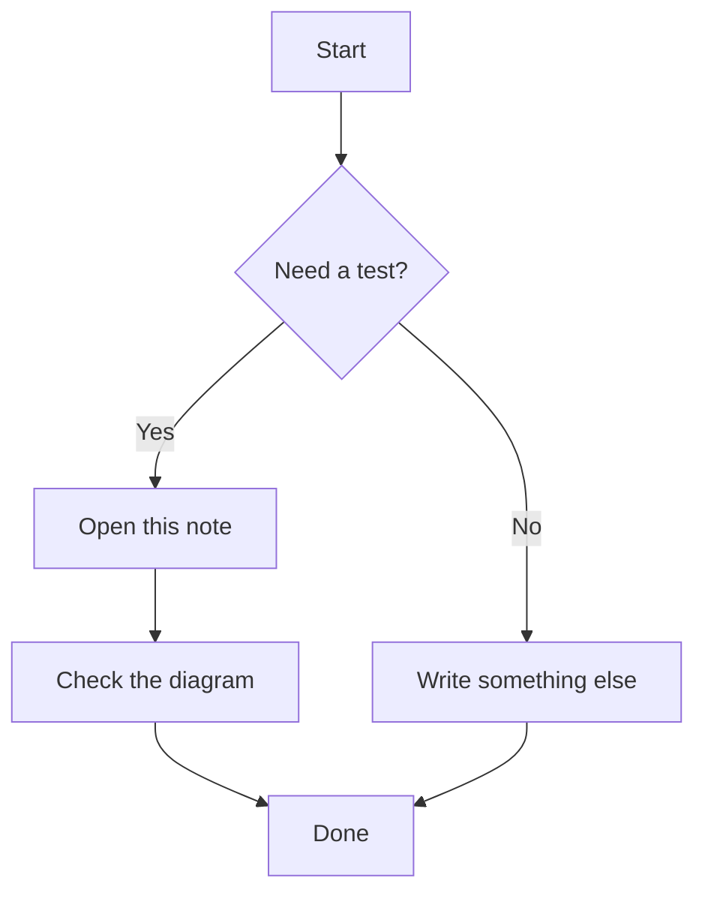
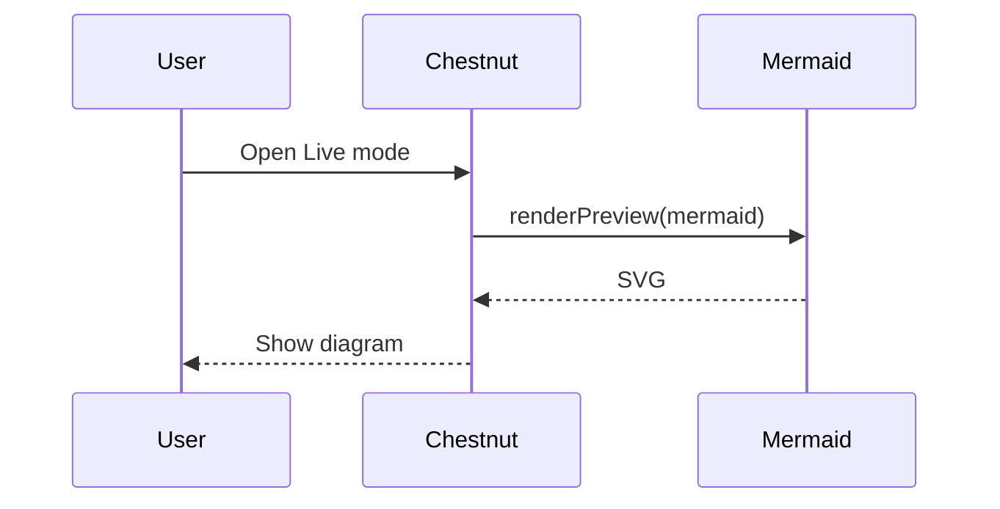
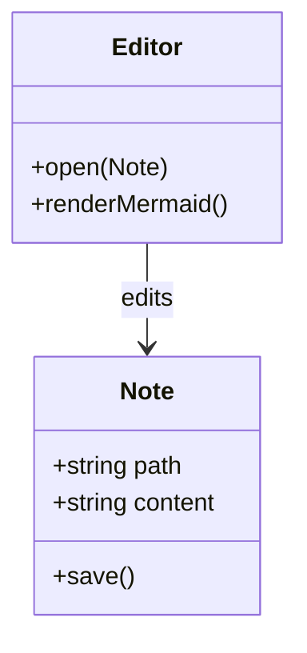
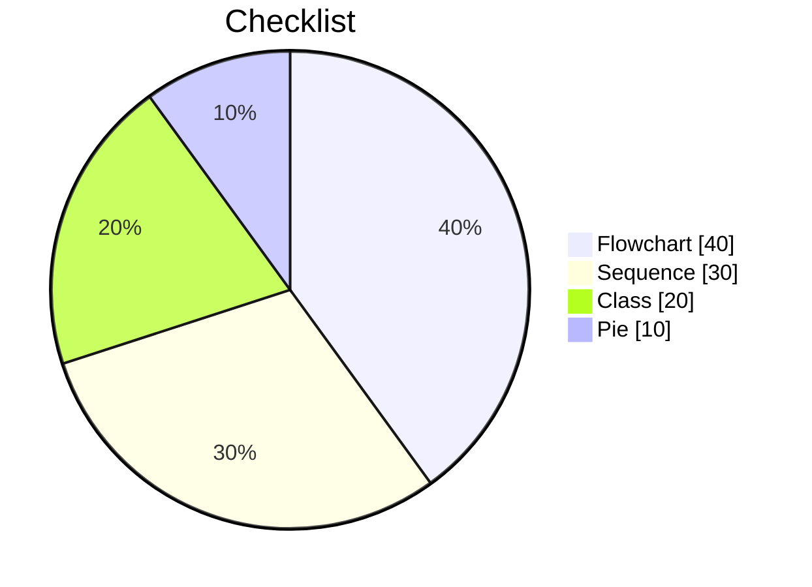

# Mermaid Demo

In **Live** mode, `mermaid` code blocks below should render as diagrams.

## Flowchart

```mermaid
flowchart TD
  A[Start] --> B{Need a test?}
  B -->|Yes| C[Open this note]
  B -->|No| D[Write something else]
  C --> E[Check the diagram]
  E --> F[Done]
  D --> F
```

## Sequence

```mermaid
sequenceDiagram
  participant U as User
  participant E as Chestnut
  participant M as Mermaid
  U->>E: Open Live mode
  E->>M: renderPreview(mermaid)
  M-->>E: SVG
  E-->>U: Show diagram
```

## Class diagram

```mermaid
classDiagram
  class Note {
    +string path
    +string content
    +save()
  }
  class Editor {
    +open(Note)
    +renderMermaid()
  }
  Editor --> Note : edits
```

## Pie chart

```mermaid
pie showData
  title Checklist
  "Flowchart" : 40
  "Sequence" : 30
  "Class" : 20
  "Pie" : 10
```
